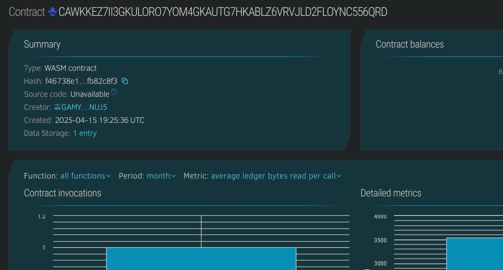

# Crowdfunded Real Estate Investment

## Project Description
**Crowdfunded Real Estate Investment** is a smart contract that enables users to collectively invest in real estate properties using blockchain technology. Each property has a funding goal, and users can contribute investments that are transparently tracked on-chain.

## Project Vision
To democratize real estate investment by lowering the barrier to entry, increasing transparency, and enabling community-driven funding for property ownership via smart contracts.

## Key Features
- 🏠 **Add New Properties**: Admins can list new properties with funding goals.
- 💰 **User Investment**: Users can invest any amount into properties.
- 📈 **Track Contributions**: Both users and admins can view contributions and total raised funds.
- 🔍 **Transparency & Trust**: Blockchain ensures trustless investment tracking.

## Future Scope
- 🧾 Tokenized ownership and share certificates.
- 🌐 Multi-property portfolios for diversification.
- 🔄 Resale or withdrawal mechanisms.
- 📊 Integration with property valuation oracles.

## Contract Details
CAWKKEZ7II3GKULORO7YOM4GKAUTG7HKABLZ6VRVJLD2FLOYNC556QRD
